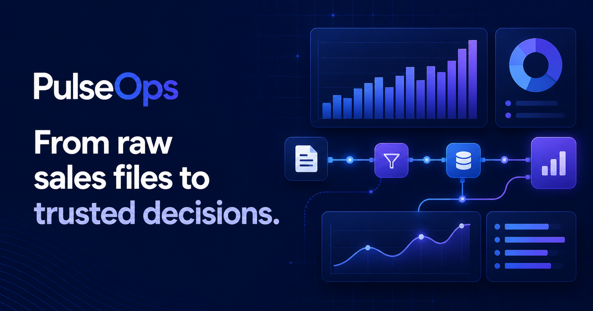
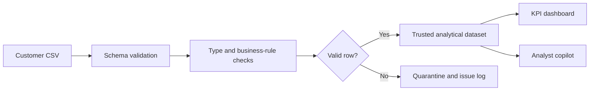

# PulseOps — Forward-Deployed Analytics

PulseOps is an interactive portfolio project that demonstrates how a Forward-Deployed Engineer can take a loosely defined customer problem and turn it into a usable data product.

The application accepts retail sales data, validates it, runs an ETL-style workflow, calculates business KPIs, and provides a simple analyst copilot for investigating the loaded dataset.



## Live Demo

**[Open PulseOps](https://pulseops-krishna-mvwala.krishna-mvwala.workers.dev)**

The hosted application is a public portfolio deployment. The repository contains no client or employer data.

## What the Project Does

PulseOps models a common customer engagement: regional teams send daily CSV extracts, but business leaders need one reliable view of revenue, margin, delivery performance, and data quality.

The application provides an end-to-end workflow:

1. **Extract** — Load a CSV sales file or use the included demonstration dataset.
2. **Validate** — Check required columns, missing values, data types, duplicate IDs, dates, and financial business rules.
3. **Transform** — Convert valid fields into typed analytical records and quarantine invalid rows.
4. **Publish** — Recalculate KPIs and regional/category views from trusted rows only.
5. **Investigate** — Ask the analyst copilot questions about revenue, margin, late orders, and quality.



## Core Features

- CSV upload with a documented data contract
- Downloadable sample dataset for demonstrations
- Required-column and row-level validation
- Invalid-row quarantine before aggregation
- Pipeline status and execution trace
- Data-quality score and validation summaries
- Revenue, gross margin, on-time delivery, and order KPIs
- Regional revenue ranking
- Category margin analysis
- Dataset-aware question-and-answer experience
- Responsive layout for desktop, tablet, and mobile
- Portfolio disclosure and customer-data privacy notice

## Data Contract

Uploaded files must contain these columns:

| Column | Type | Description |
| --- | --- | --- |
| `order_id` | Text | Unique identifier for an order |
| `date` | Date | Order date in a parseable date format |
| `region` | Text | Sales or operating region |
| `category` | Text | Product category |
| `revenue` | Number | Revenue generated by the order |
| `cost` | Number | Cost associated with the order |
| `status` | Text | Delivery status, such as `Delivered` or `Late` |

The validation layer checks:

- Presence of all required columns
- Required text values
- Numeric revenue and cost values
- Non-negative financial values
- Cost greater than revenue as a warning condition
- Parseable dates
- Duplicate order IDs

Valid rows are used for dashboard calculations. Rows with errors are excluded, while warnings remain visible for investigation.

## KPI Definitions

| KPI | Calculation |
| --- | --- |
| Total revenue | Sum of revenue across valid rows |
| Gross margin | `(revenue - cost) / revenue` |
| On-time rate | Non-late orders divided by valid orders |
| Data-quality score | A demonstration score reduced by validation errors, warnings, and duplicates |

## Analyst Copilot

The copilot answers questions using calculations from the currently loaded dataset. It can explain:

- Which region leads revenue
- Which category has the strongest margin
- Whether data-quality issues were detected
- Where operations should investigate late orders
- Overall revenue, order count, and margin

This version uses deterministic in-browser analytical logic rather than an external LLM. That keeps the demo fast, private, and usable without API credentials. A production extension could connect the validated dataset to an approved language model with access controls, citations, and audit logging.

## Try It

1. Open the [live application](https://pulseops-krishna-mvwala.krishna-mvwala.workers.dev).
2. Select **Download sample CSV** or use [`sample-data/pulseops_sample_sales.csv`](sample-data/pulseops_sample_sales.csv).
3. Upload the file.
4. Review the validation and source-row counts.
5. Select **Run ETL pipeline**.
6. Inspect the executive KPIs and charts.
7. Ask Pulse: `Which region leads revenue?`

## Run Locally

### Requirements

- Node.js 22.13 or newer
- npm

### Installation

```bash
git clone https://github.com/krishnababby01/pulseops-forward-deployed-analytics.git
cd pulseops-forward-deployed-analytics
npm install
npm run dev
```

Open the local URL printed by the development server.

### Build Validation

```bash
npm run build
```

## Technology

- React 19
- TypeScript
- Next.js-compatible application structure
- vinext and Vite
- Cloudflare-compatible deployment output
- CSS-based responsive dashboard visualization
- Browser `FileReader` and client-side CSV processing

No database, external API, or authentication is required for the current demonstration.

## Project Structure

```text
app/
  globals.css       Application design system and responsive layout
  layout.tsx        Metadata and social-sharing configuration
  page.tsx          CSV ingestion, ETL validation, KPIs, and copilot
public/
  og.png            Social-sharing preview
sample-data/
  pulseops_sample_sales.csv
docs/
  PROJECT_REPORT.md Detailed case study and implementation report
.openai/
  hosting.json      Hosting configuration
```

## Forward-Deployed Engineering Skills Demonstrated

- Translating a customer objective into technical requirements
- Defining a data contract and validation rules
- Building a usable end-to-end solution instead of an isolated component
- Designing for business users and technical operators
- Communicating data lineage, quality, and KPI definitions
- Protecting customer information through a synthetic-data portfolio scenario
- Explaining limitations and planning production extensions

For the complete case study, see [Project Report](docs/PROJECT_REPORT.md).

## Current Limitations

- Uploaded data remains only in the current browser session.
- The CSV parser is intentionally lightweight and is not intended for very large files.
- The copilot is analytical and deterministic; it is not connected to an LLM.
- The demo does not include authentication, durable storage, scheduling, or role-based access.

These boundaries are intentional for a safe, portable portfolio demonstration. The project report describes how each area could be extended for production.

## Author

**Krishna Mvwala**  
Senior Data Analyst | Business Intelligence Developer

This is an independent portfolio project. All organizations, scenarios, and data shown in the application are fictional or synthetic. No confidential client, employer, patient, or customer data is used.
