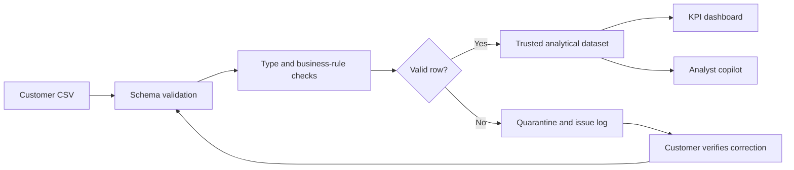

# PulseOps — Forward-Deployed Analytics

PulseOps is an interactive portfolio project that demonstrates how a Forward-Deployed Engineer can take a loosely defined customer problem and turn it into a usable data product.

The application accepts retail sales data, runs a staged ETL workflow, safely corrects common formatting problems, quarantines risky records, supports human-verified correction and revalidation, calculates business KPIs from trusted rows, and provides a SQL-backed analyst copilot for investigating the published dataset.


## Live Demo

**[Open PulseOps](https://pulseops-krishna-mvwala.krishna-mvwala.workers.dev)**

The hosted application is a public portfolio deployment. The repository contains no client or employer data.

## What the Transform Stage Means

In PulseOps, the transform stage performs safe type conversion and normalization, then separates trusted records from records that require review. It intentionally quarantines values that cannot be corrected without inventing information.

Transform does not always mean automatically “fix everything.” For example:

- A missing revenue value cannot be safely guessed.
- A negative number could be an input error or a legitimate refund, so the pipeline should not reinterpret it without business context.
- Two records with the same order ID may contain conflicting information.
- An impossible date cannot be corrected without knowing the intended date.

This approach protects the reliability of the published dataset: deterministic formatting problems are corrected, while ambiguous business values remain visible for investigation instead of being silently changed.

### How quarantined records become trusted

Quarantine is a review queue, not a dead end. A customer can open **Review & correct** for a quarantined row, confirm the intended value with the source system or record owner, enter the verified correction, and select **Validate & republish**. PulseOps reruns the complete ETL contract—including type, date, financial, and duplicate checks—before allowing that row into the trusted dataset.

If any problem remains, the record stays quarantined and the interface explains why. If it passes, PulseOps immediately refreshes the trusted-row count, data-quality comparison, KPIs, downloadable cleaned CSV, and SQL-backed analyst answers. A session audit records the source row, time, and before/after values for every accepted manual correction.

## What the Project Does

PulseOps models a common customer engagement: regional teams send daily CSV extracts, but business leaders need one reliable view of revenue, margin, delivery performance, and data quality.

The application provides an end-to-end workflow:

1. **Extract** — Load a CSV sales file or use the included demonstration dataset.
2. **Validate** — Check required columns, missing values, data types, duplicate IDs, dates, and financial business rules without changing the raw upload.
3. **Transform** — Normalize safe formatting differences, remove exact duplicates, and quarantine values that would require guessing.
4. **Review** — Let the customer enter source-verified corrections; rerun the full data contract and retain a before/after audit trail.
5. **Publish** — Recalculate KPIs and regional/category views from trusted rows only, with a downloadable cleaned CSV.
6. **Investigate** — Ask the analyst copilot questions about revenue, margin, late orders, and quality. The app maps supported questions to approved SQL templates, runs them against the in-memory trusted table, and exposes the query behind each answer.



## Core Features

- CSV upload with a documented data contract
- Downloadable sample dataset for demonstrations
- Required-column and row-level validation
- Safe automatic correction of whitespace, casing, dates, and formatted numbers
- Exact-duplicate removal and conflicting-ID quarantine
- Invalid-row quarantine before aggregation
- Row-level quarantine table with the original value and validation reason
- Customer correction form that highlights the failed fields and preserves original values
- Full-contract revalidation before a corrected record can be republished
- Immediate KPI, cleaned-CSV, and analyst-query refresh after accepted corrections
- Session audit trail with source row and before/after values
- Pipeline status and execution trace
- Before-and-after data-quality comparison and transformation summary
- Downloadable cleaned CSV after a successful pipeline run
- Revenue, gross margin, on-time delivery, and order KPIs
- Regional revenue ranking
- Category margin analysis
- SQL-backed, dataset-aware question-and-answer experience
- Ranked answer tables, trusted-row coverage, and an expandable SQL execution trace
- Responsive layout for desktop, tablet, and mobile
- Portfolio disclosure and customer-data privacy notice

## Data Contract

Uploaded files must contain these columns:

| Column | Type | Description |
| --- | --- | --- |
| `order_id` | Text | Unique identifier for an order |
| `date` | Date | Order date in a parseable date format |
| `region` | Text | Sales or operating region |
| `category` | Text | Product category |
| `revenue` | Number | Revenue generated by the order |
| `cost` | Number | Cost associated with the order |
| `status` | Text | Delivery status, such as `Delivered` or `Late` |

The validation layer checks:

- Presence of all required columns
- Required text values
- Numeric revenue and cost values
- Non-negative financial values
- Cost greater than revenue as a quarantine condition
- Parseable dates
- Exact duplicate records and conflicting duplicate order IDs

Safe formatting differences are corrected and logged. Exact duplicate records are removed once. Rows with missing values, invalid dates or numbers, negative financial values, cost above revenue, or conflicting duplicate IDs are quarantined rather than guessed. Only published rows are used for dashboard calculations.

## KPI Definitions

| KPI | Calculation |
| --- | --- |
| Total revenue | Sum of revenue across valid rows |
| Gross margin | `(revenue - cost) / revenue` |
| On-time rate | Non-late orders divided by valid orders |
| Source quality | A demonstration score reduced by findings, required corrections, and duplicates |
| Published quality | Percentage indicating whether the released rows pass all publish rules |

## SQL-Backed Analyst Copilot

The copilot runs real SQL against an in-memory `trusted_sales` table created from the currently published rows. For example, asking `Show the top 2 regions by revenue` executes an approved aggregation with `GROUP BY`, `ORDER BY`, and `LIMIT 2`, then returns the ranked answer, revenue values, order counts, trusted-row coverage, and the exact SQL statement.

It can answer:

- Which regions lead revenue, including the requested top 1–5
- Which categories have the strongest margin, including the requested top 1–5
- Whether data-quality issues were detected
- Where operations should investigate late orders
- Overall revenue, order count, and margin

Natural-language wording selects only from allowlisted query templates; typed text is never inserted directly into SQL. This version uses deterministic in-browser question routing and AlaSQL rather than an external LLM or shared database. Uploaded data therefore stays in the browser, and the demo remains usable without API credentials. A production extension could connect the validated dataset to an approved language model and warehouse with access controls, semantic definitions, citations, and audit logging.

## Try It

1. Open the [live application](https://pulseops-krishna-mvwala.krishna-mvwala.workers.dev).
2. Select **Download sample CSV** or use [`sample-data/pulseops_sample_sales.csv`](sample-data/pulseops_sample_sales.csv).
3. Upload the file.
4. Confirm that the raw file is extracted but still waiting for ETL.
5. Select **Run ETL pipeline**.
6. Review safe corrections, removed duplicates, and the row-level quarantine reasons.
7. For a quarantined row, select **Review & correct**, enter only a source-verified value, then select **Validate & republish**.
8. Confirm the trusted-row count, KPIs, cleaned CSV, and manual correction audit update after the record passes.
9. Download the cleaned CSV and inspect the executive KPIs.
10. Ask Pulse: `Show the top 2 regions by revenue`.
11. Expand **View SQL executed** to inspect the query and confirm which trusted rows were used.

## Run Locally

### Requirements

- Node.js 22.13 or newer
- npm

### Installation

```bash
git clone https://github.com/krishnamvwala/pulseops-forward-deployed-analytics.git
cd pulseops-forward-deployed-analytics
npm ci --include=dev
npm run dev
```

The lockfile selects the correct native packages automatically for Apple Silicon,
Intel macOS, Windows, or Linux. Open the local URL printed by the development
server.

### Build Validation

```bash
npm run build
```

## Technology

- React 19
- TypeScript
- Next.js-compatible application structure
- vinext and Vite
- Cloudflare-compatible deployment output
- AlaSQL for browser-side SQL execution over trusted rows
- CSS-based responsive dashboard visualization
- Browser `FileReader` and client-side CSV processing

No database, external API, or authentication is required for the current demonstration.

## Project Structure

```text
app/
  etl.ts           Extraction, validation, transformation, quarantine, and CSV export
  globals.css       Application design system and responsive layout
  layout.tsx        Metadata and social-sharing configuration
  page.tsx          Interactive pipeline controls, KPIs, and copilot
  sql-analyst.ts    Approved question templates, in-memory SQL, and formatted answers
public/
  og.png            Social-sharing preview
sample-data/
  pulseops_sample_sales.csv
docs/
  PROJECT_REPORT.md Detailed case study and implementation report
tests/
  etl.test.mjs      Messy-data transformation and quarantine tests
  rendered-html.test.mjs
  sql-analyst.test.mjs
.openai/
  hosting.json      Hosting configuration
```

## Forward-Deployed Engineering Skills Demonstrated

- Translating a customer objective into technical requirements
- Defining a data contract and validation rules
- Building a usable end-to-end solution instead of an isolated component
- Designing for business users and technical operators
- Communicating data lineage, quality, and KPI definitions
- Protecting customer information through a synthetic-data portfolio scenario
- Explaining limitations and planning production extensions

For the complete case study, see [Project Report](docs/PROJECT_REPORT.md).

## Current Limitations

- Uploaded data remains only in the current browser session.
- The CSV parser is intentionally lightweight and is not intended for very large files.
- The copilot is analytical and deterministic; it is not connected to an LLM.
- The demo does not include authentication, durable storage, scheduling, or role-based access.

These boundaries are intentional for a safe, portable portfolio demonstration. The project report describes how each area could be extended for production.

## Author

**Krishna Mvwala**

Senior Data Analyst | Data Engineering | Forward-Deployed Analytics

This is an independent portfolio project. All organizations, scenarios, and data shown in the application are fictional or synthetic. No confidential client, employer, patient, or customer data is used.
