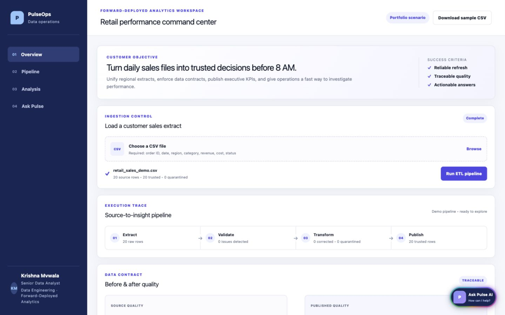
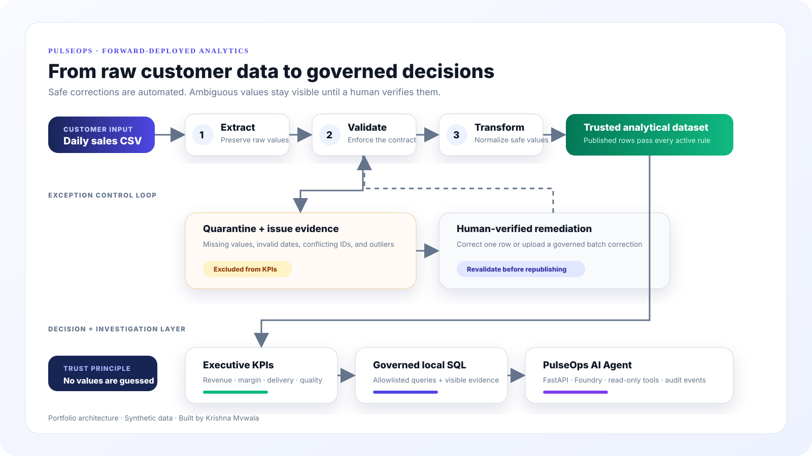
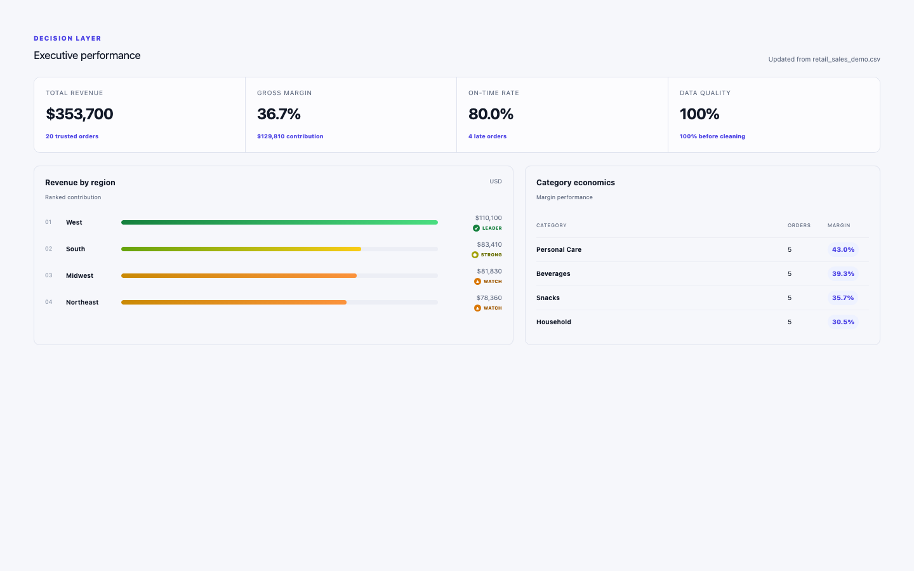
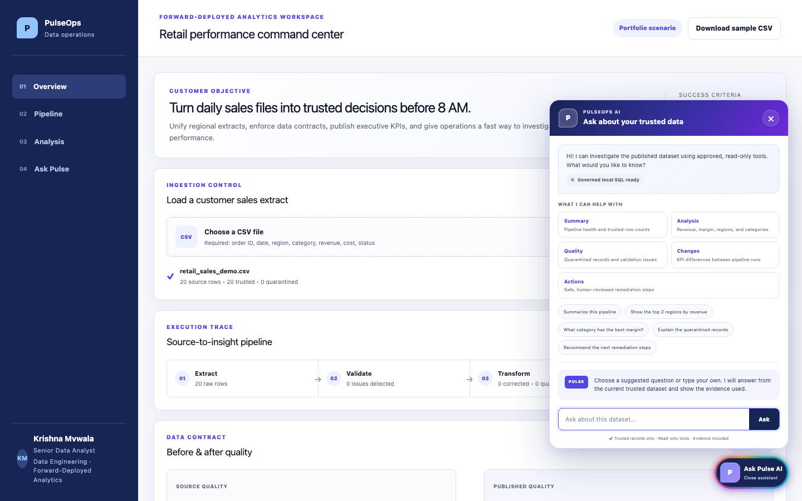

# PulseOps — Forward-Deployed Analytics & Governed AI

**An independent portfolio case study by Krishna Mvwala.** PulseOps turns inconsistent retail sales files into trusted KPIs, traceable exceptions, and evidence-backed analytical answers.

[Open the live application](https://pulseops-krishna-mvwala.krishna-mvwala.workers.dev) · [Follow the 6-minute demo](docs/DEMO_GUIDE.md) · [Explore the AI Agent](https://github.com/krishnamvwala/pulseops-ai-agent)



## The customer problem

A fictional multi-region retailer receives daily CSV extracts from several operating teams. Missing values, inconsistent formats, duplicate IDs, impossible dates, and unexpected financial values make executive reporting slow and difficult to trust.

The objective is simple: **turn daily sales files into trusted decisions before 8 AM.**

| Need | PulseOps response |
| --- | --- |
| Reliable daily reporting | Contract-driven ETL with an observable execution trace |
| KPIs that leaders can trust | Revenue, margin, and delivery metrics calculated from published rows only |
| A way to resolve bad data | Quarantine queue, source-row lineage, individual and batch remediation |
| Faster investigation | Governed local SQL plus a separately deployable Microsoft Foundry agent |
| Explainable controls | Before/after quality, correction evidence, SQL traces, and audit events |

## What I built

I took the case study from discovery to deployment:

- translated the customer objective into success criteria, a seven-field data contract, KPI definitions, and an exception policy;
- engineered browser-based ETL that validates CSV data, performs safe deterministic corrections, removes exact duplicates, and quarantines risky rows;
- added configurable revenue guardrails using a business ceiling and a conservative median/IQR rule;
- preserved `source_row` lineage and built audited individual, exception-approval, and batch-remediation workflows;
- delivered an executive dashboard and an allowlisted SQL-backed analytical assistant over trusted records;
- integrated the interface with a separate FastAPI/PostgreSQL/Microsoft Foundry service that exposes five governed read-only tools; and
- deployed the public application on Cloudflare with synthetic data and no required login.

## Product flow



The central design rule is **no values are guessed**. PulseOps automatically fixes only deterministic formatting differences. Missing revenue, impossible dates, conflicting IDs, negative financial values, and suspicious outliers remain quarantined until someone verifies the intended value. Every correction is fully revalidated before it can affect a KPI.

[Read the architecture and production boundaries](docs/ARCHITECTURE.md)

## Decision layer



The dashboard calculates total revenue, gross margin, on-time delivery, regional ranking, category economics, and published quality from trusted rows only. That makes the result explainable: every included record passed the active contract, and every excluded record retains its issue evidence.

## Governed investigation



The public application stays useful without accounts or API credentials. Supported questions map to approved in-browser SQL templates, and the exact SQL plus trusted-row coverage can be inspected. Natural-language text never becomes executable free-form SQL.

For a local full-stack demonstration, the separate [PulseOps AI Agent](https://github.com/krishnamvwala/pulseops-ai-agent) lets Microsoft Foundry select among five typed, pipeline-scoped, read-only tools. PulseOps constructs factual answers from validated tool output and returns the provider, tool calls, evidence, and audit identifiers. The agent cannot guess corrections or publish data.

## Revenue outlier policy

The default contract quarantines revenue above **$100,000 per order**. With at least 20 numeric rows, an optional adaptive rule also flags a value only when it exceeds both:

- `10 × median revenue`; and
- `Q3 + 3 × IQR`.

The customer can correct an outlier using a source-verified value or approve the original value as a legitimate exception with a written reason. PulseOps never replaces an outlier with an average or silently caps it.

## Technology

| Layer | Technology |
| --- | --- |
| Product interface | React 19, TypeScript, CSS |
| Application runtime | vinext, Vite, Cloudflare Workers |
| Data processing | Browser `FileReader`, deterministic ETL, source-row lineage |
| Analytics | AlaSQL, allowlisted analytical templates |
| AI agent service | Python, FastAPI, PostgreSQL, Microsoft Foundry |
| Quality | Node test runner, ESLint, deployment build validation |

## Try it in six minutes

1. Open the [live application](https://pulseops-krishna-mvwala.krishna-mvwala.workers.dev).
2. Download the included sample CSV and run the ETL pipeline.
3. Review the execution trace and before/after quality.
4. Inspect the trusted KPI dashboard.
5. Open **Ask Pulse AI** and choose **Show the top 2 regions by revenue**.
6. For the complete exception-remediation story and interview talking points, use the [Demo Guide](docs/DEMO_GUIDE.md).

## Run locally

Requirements: Node.js 22.13 or newer and npm.

```bash
git clone https://github.com/krishnamvwala/pulseops-forward-deployed-analytics.git
cd pulseops-forward-deployed-analytics
npm ci --include=dev
npm run dev
```

Validate the project with:

```bash
npm run lint
npm test
```

Standalone mode needs no backend, database, account, or API key. To demonstrate the full Microsoft Foundry agent integration, run the separate agent service and set:

```dotenv
NEXT_PUBLIC_PULSEOPS_AGENT_API_URL=http://127.0.0.1:8000/api/v1
```

## Documentation

- [Interview Demo Guide](docs/DEMO_GUIDE.md)
- [Architecture and trust model](docs/ARCHITECTURE.md)
- [Detailed Project Report](docs/PROJECT_REPORT.md)
- [Synthetic sample dataset](sample-data/pulseops_sample_sales.csv)
- [PulseOps AI Agent repository](https://github.com/krishnamvwala/pulseops-ai-agent)

## Current boundary

This public portfolio deployment processes uploaded data in the current browser session. It intentionally does not provide durable storage, scheduled ingestion, authentication, or role-based access. A production version would move large-file processing and persistence to server-side infrastructure, then add identity, authorization, retention, monitoring, and cost controls. The local agent API also requires those security controls before public deployment.

## Portfolio disclosure and license

PulseOps is an independent portfolio project built with synthetic data. It contains no confidential client, employer, patient, or customer information.

Copyright © 2026 Krishna Mvwala. The source is public for recruitment and non-commercial evaluation, but it may not be sold, redistributed, sublicensed, or presented as another person's original work. See the [PulseOps Portfolio Evaluation License](LICENSE).

**Krishna Mvwala** — Senior Data Analyst | Data Engineering | Forward-Deployed Analytics
