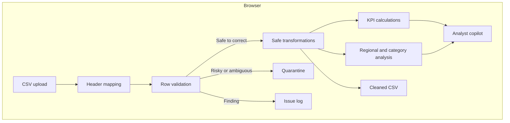

# PulseOps Project Report

## Executive Summary

PulseOps is a forward-deployed analytics case study built by Krishna Mvwala. It demonstrates the complete path from customer discovery to a deployed data product: define the business objective, establish a data contract, validate source data, transform trusted records, deliver operational KPIs, and support investigation through a conversational analytical interface.

The project is intentionally implemented as a safe portfolio scenario. It uses synthetic sales records and does not contain information from a client or employer.

## Customer Scenario

A multi-region retail organization receives daily sales extracts from several operating teams. Reporting is slow and difficult to trust because files may have missing values, duplicate order identifiers, invalid dates, or unexpected financial values. Business leaders need a reliable performance view before the start of the operating day.

### Customer Objective

Turn daily sales files into trusted decisions before 8:00 AM.

### Success Criteria

- A business user can load a standard CSV without technical assistance.
- Invalid data is identified before it affects KPIs.
- The user can trace data from source file to published dashboard.
- Revenue, margin, delivery, and quality are visible in one workspace.
- Common business questions can be answered from the current dataset.
- No customer data is stored by the demonstration application.

## Requirements and Delivery

| Requirement | Delivery |
| --- | --- |
| Simple ingestion | Browser-based CSV upload and sample-file download |
| Repeatable input format | Seven-column data contract |
| Data-quality controls | Schema, completeness, type, uniqueness, date, and business-rule checks |
| Error isolation | Risky rows quarantined before analytical calculations |
| Safe correction | Formatting, date, and numeric normalization with a correction log |
| Operational transparency | Four-stage pipeline execution trace |
| Executive reporting | Revenue, margin, on-time rate, and quality KPIs |
| Performance investigation | Regional ranking and category economics |
| Guided analysis | Dataset-aware analytical copilot |
| Confidentiality | Synthetic scenario, session-only processing, no database |

## Solution Architecture



All data processing occurs in the browser. The demonstration does not send uploaded data to an API or persist it in a database.

## ETL Workflow

### 1. Extract

The application reads the selected CSV with the browser `FileReader` API. The first row is normalized into lowercase column names and compared with the required data contract. At this stage, the source records remain raw and the dashboard waits for the user to run ETL.

### 2. Validate

The application checks each source row for:

- Required text values
- Numeric revenue and cost
- Non-negative financial values
- Parseable dates
- Exact and conflicting repeated order identifiers
- Cost greater than revenue

Findings are classified by action. A value is corrected only when the transformation is deterministic. A row is quarantined when repairing it would require inventing business data.

### 3. Transform

Accepted values are converted to a typed `SalesRow` structure. The pipeline trims whitespace, standardizes casing and known labels, converts supported dates to ISO format, and removes currency separators from numeric fields. Exact duplicate records are removed once. Missing values, invalid dates or numbers, negative financial values, cost above revenue, and conflicting duplicate IDs are quarantined.

### 4. Publish

The interface compares source quality with published quality, reports corrections and exceptions, enables a cleaned-CSV download, and recomputes KPI cards, region rankings, category margins, and copilot context from published rows only.

## Business Metrics

### Total Revenue

The sum of `revenue` across trusted records.

### Gross Margin

```text
(total revenue - total cost) / total revenue
```

### On-Time Rate

Orders whose status is not `Late`, divided by the total number of trusted orders.

### Data-Quality Score

The current version uses a demonstration score that starts at 100 and applies penalties for validation errors, warnings, and duplicate identifiers. In production, quality scoring should use agreed business weights, thresholds, service-level objectives, and historical trends.

## Analyst Copilot Design

The copilot interprets a small set of business intents and calculates answers directly from the loaded data. Supported topics include:

- Revenue by region
- Margin by category
- Data-quality issues
- Late-order operational focus
- Overall dataset summary

The design intentionally does not claim to be a production AI assistant. It is a deterministic proof of concept that demonstrates how an analytical interface can be layered over trusted data. A production version could introduce an LLM only after adding:

- Approved model access
- Row-level permissions
- Grounded query generation
- Result citations
- Prompt and response audit logs
- Sensitive-data controls
- Evaluation and hallucination monitoring

## User Experience Decisions

- The customer objective appears before technical controls.
- Pipeline stages provide understandable data lineage.
- Validation uses plain-language checks rather than only error codes.
- The interface separates corrected values from quarantined records so users can see what changed and why.
- KPIs show both the headline result and supporting context.
- Suggested questions help a new user discover the copilot.
- The portfolio disclosure separates demonstrated capability from client claims.

## Security and Privacy

- The included dataset is synthetic.
- Uploaded files are processed in the browser session.
- The current application does not intentionally persist uploaded records.
- No LLM or external analytical API receives uploaded data.
- No client or employer names appear in the solution.
- Production deployments would require formal authentication, authorization, encryption, retention, and audit policies.

## Forward-Deployed Engineer Responsibilities Demonstrated

### Discovery

Translated a business goal—trusted daily reporting—into success criteria and functional requirements.

### Data Engineering

Defined an input contract, implemented validation rules, converted source fields, and controlled which records entered the analytical layer.

### Product Engineering

Combined ingestion, observability, analysis, and guided investigation in one interactive application.

### Customer Communication

Presented business outcomes, pipeline stages, KPI definitions, data-quality results, and solution limitations in nontechnical language.

### Deployment

Produced a Cloudflare-compatible build and a hosted demonstration with a custom social-sharing preview.

## Demonstration Script

1. Explain the fictional customer objective.
2. Download or open the supplied sample CSV.
3. Upload the file and show that it is extracted but not yet transformed.
4. Run the ETL pipeline and explain each stage.
5. Review corrections, removed duplicates, quarantined rows, and before/after quality.
6. Download the cleaned CSV.
7. Compare regional revenue and category margins.
8. Ask the copilot which region leads revenue.
9. Explain that answers are calculated from the published dataset.
10. Close with production extensions and security requirements.

## Validation

The application passed its deployment build, server-render test, and automated messy-data ETL tests before publication. The ETL tests cover safe normalization, exact-duplicate removal, negative values, missing values, invalid dates, cost above revenue, and conflicting duplicate IDs.

Recommended manual acceptance checks:

- Upload the included sample CSV.
- Upload a file with a missing required column.
- Upload rows with invalid numbers or dates.
- Upload a duplicate order ID.
- Confirm that KPI values change with a different valid dataset.
- Confirm that copilot answers reflect the current data.
- Check the interface at desktop and mobile widths.

## Production Roadmap

### Phase 1 — Durable Ingestion

- Object storage for uploaded source files
- Server-side parsing for large files
- Scheduled source-system ingestion
- Idempotent pipeline runs
- Persisted run history and issue logs

### Phase 2 — Governance

- Authentication and role-based access
- Tenant and dataset isolation
- Data retention and deletion policies
- Audit trails
- Configurable quality thresholds

### Phase 3 — Advanced Analytics

- Time-series trends
- Drill-through analysis
- Anomaly detection
- Forecasting
- KPI alerts and operational workflows

### Phase 4 — Governed AI

- Semantic model and query service
- LLM tool calling against approved metrics
- Source citations
- Evaluation suite
- Cost, latency, and safety monitoring

## Repository and Deployment

- Live application: [PulseOps](https://pulseops-krishna-mvwala.krishna-mvwala.workers.dev)
- Application source: React, TypeScript, vinext, and Vite
- Deployment shape: Cloudflare-compatible output
- Data storage: Session-only for the current portfolio version

## Author

Krishna Mvwala

Senior Data Analyst | Business Intelligence Developer

This report describes an independent portfolio project. It does not represent a production system delivered for a named customer or employer.
