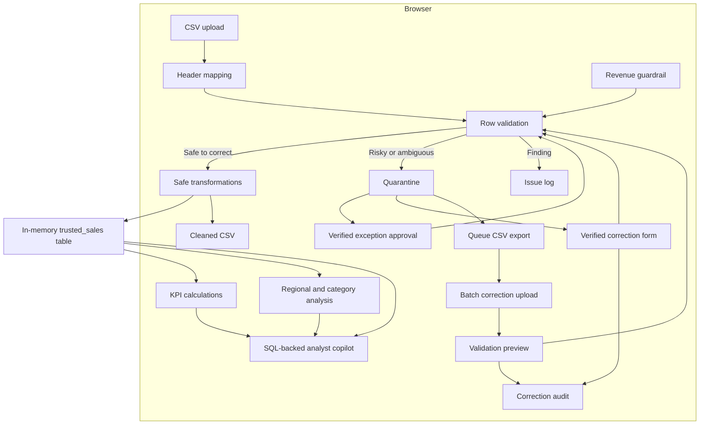

# PulseOps Project Report

> **Independent portfolio case study:** PulseOps was designed and built by Krishna Mvwala using synthetic data. It is not a project for a current or former employer.

## Executive Summary

PulseOps is a forward-deployed analytics case study built by Krishna Mvwala. It demonstrates the complete path from customer discovery to a deployed data product: define the business objective, establish a data contract, validate source data, transform trusted records, deliver operational KPIs, and support investigation through a conversational analytical interface.

The project is intentionally implemented as a safe portfolio scenario. It uses synthetic sales records and does not contain information from a client or employer.

## Customer Scenario

A multi-region retail organization receives daily sales extracts from several operating teams. Reporting is slow and difficult to trust because files may have missing values, duplicate order identifiers, invalid dates, or unexpected financial values. Business leaders need a reliable performance view before the start of the operating day.

### Customer Objective

Turn daily sales files into trusted decisions before 8:00 AM.

### Success Criteria

- A business user can load a standard CSV without technical assistance.
- Invalid data is identified before it affects KPIs.
- The user can trace data from source file to published dashboard.
- Revenue, margin, delivery, and quality are visible in one workspace.
- Common business questions can be answered from the current dataset.
- No customer data is stored by the demonstration application.

## Requirements and Delivery

| Requirement | Delivery |
| --- | --- |
| Simple ingestion | Browser-based CSV upload and sample-file download |
| Repeatable input format | Seven-column data contract |
| Data-quality controls | Schema, completeness, type, uniqueness, date, and business-rule checks |
| Error isolation | Risky rows quarantined with source values and row-level reasons before analytical calculations |
| Safe correction | Formatting, date, and numeric normalization with a correction log |
| Revenue anomaly control | Configurable $100,000 default order ceiling plus a conservative median/IQR rule |
| Governed exception approval | Source-verified reason, unchanged original revenue, complete revalidation, and audit outcome |
| Human remediation | Source-verified edits, complete revalidation, immediate republishing, and a before/after session audit |
| Scalable exception review | Fifteen-record pages, internal scrolling, search, issue filters, queue export, and batch re-upload |
| Governed batch correction | Pre-publication impact preview with passing, unresolved, duplicate, and trusted-row counts |
| Operational transparency | Four-stage pipeline execution trace |
| Executive reporting | Revenue, margin, on-time rate, and quality KPIs |
| Performance investigation | Regional ranking and category economics |
| Guided analysis | SQL-backed analytical copilot with visible query evidence |
| Confidentiality | Synthetic scenario; session-only standalone mode; governed local service for the full-stack demonstration |

## Solution Architecture



In the public standalone deployment, all data processing occurs in the browser: uploaded data is not sent to an API or persisted in a database. In the configured full-stack demonstration, the dashboard sends the current synthetic pipeline to the separate PulseOps AI Agent. That local FastAPI service persists the imported run in PostgreSQL and can let Microsoft Foundry select from five governed read-only tools. These modes are explicit in the interface, and no Azure or database credential is placed in the browser.

## ETL Workflow

### 1. Extract

The application reads the selected CSV with the browser `FileReader` API. The first row is normalized into lowercase column names and compared with the required data contract. At this stage, the source records remain raw and the dashboard waits for the user to run ETL.

### 2. Validate

The application checks each source row for:

- Required text values
- Numeric revenue and cost
- Non-negative financial values
- Parseable dates
- Exact and conflicting repeated order identifiers
- Cost greater than revenue
- Revenue above the configured per-order ceiling
- Conservative adaptive revenue outliers when at least 20 numeric values are available

Findings are classified by action. A value is corrected only when the transformation is deterministic. A row is quarantined when repairing it would require inventing business data. Revenue starts with a configurable $100,000 per-order ceiling. With 20 or more numeric revenue values, the optional adaptive rule flags a value only when it exceeds both 10 times the median and `Q3 + 3 × IQR`.

### 3. Transform

Accepted values are converted to a typed `SalesRow` structure. The pipeline trims whitespace, standardizes casing and known labels, converts supported dates to ISO format, and removes currency separators from numeric fields. Exact duplicate records are removed once. Missing values, invalid dates or numbers, revenue outliers, negative financial values, cost above revenue, and conflicting duplicate IDs are quarantined.

### 4. Publish

The interface compares source quality with published quality, reports corrections and exceptions, displays every quarantined record with its source row, order ID, original value, and reason, enables a cleaned-CSV download, and recomputes KPI cards, region rankings, category margins, and copilot context from published rows only.

### 5. Correct and Republish

A quarantined row can be opened in a customer correction form that displays all seven source fields, highlights the fields that failed validation, and retains the original value beside each input. The customer must verify the intended values outside PulseOps before editing; the application never invents a replacement.

Selecting **Validate & republish** reruns the entire dataset through the same ETL contract. A row remains quarantined when any rule still fails, and a change that collapses into an existing exact duplicate is not described as a new trusted record. An accepted correction updates the in-memory source records, trusted dataset, quality scores, KPI cards, cleaned CSV, and SQL-backed analyst context in one state transition. The session audit records the source row, order ID, time, changed fields, and before/after values.

For high-volume exception review, the queue renders no more than 15 records per page inside a fixed-height scrollable table. Users can search order IDs, source rows, values, and reasons; filter missing, date, financial, duplicate, and other issues; and move between pages without creating thousands of table elements.

The batch workflow exports every quarantined source row with all original fields, issue fields, and reasons. The customer retains `source_row`, updates only values verified against the source system, and uploads the correction file. Before any state changes, PulseOps previews how many rows were submitted, edited, eligible to publish, still quarantined, or removed as duplicates, plus the net change to trusted rows. Confirmation reruns the whole dataset and refreshes every downstream consumer.

A revenue outlier has a second governed path when the original amount is confirmed to be legitimate. The reviewer can approve the unchanged value only after entering a specific reason. PulseOps records the source row, order, revenue, time, reason, and publication outcome in the decision audit, then reruns the complete contract. The approval removes only the outlier finding; missing fields, invalid dates, duplicates, or other failed rules still block publication. Changes to the global revenue ceiling or adaptive-rule switch are also audited and trigger full-file revalidation.

### Demonstration Scale Versus Production Scale

PulseOps intentionally processes data in the browser for a public, credential-free portfolio demonstration. Queue paging prevents the interface from rendering every exception simultaneously, but a real 100,000-row workload should use object storage for input files, server-side/background validation, persisted run and issue tables, and database-backed pagination. Repeated problems should be corrected at the source or through an approved bulk rule; record-by-record review is appropriate only for ambiguous exceptions.

## Business Metrics

### Total Revenue

The sum of `revenue` across trusted records.

### Gross Margin

```text
(total revenue - total cost) / total revenue
```

### On-Time Rate

Orders whose status is not `Late`, divided by the total number of trusted orders.

### Data-Quality Score

The current version uses a demonstration score that starts at 100 and applies penalties for validation errors, warnings, and duplicate identifiers. In production, quality scoring should use agreed business weights, thresholds, service-level objectives, and historical trends.

## Analyst Copilot Design

The public standalone copilot interprets a small set of business intents, selects an approved SQL template, and executes it against the browser's in-memory `trusted_sales` table. The result includes the plain-language answer, a ranked result table, the trusted-row coverage, and an expandable copy of the exact SQL. Supported topics include:

- Revenue by region
- Margin by category
- Data-quality issues
- Late-order operational focus
- Overall dataset summary

Limits are parsed as bounded integers from 1–5, and unrecognized user text never enters the SQL statement. This credential-free path keeps the public demo available when the agent service is not running.

The implemented full-stack path connects the same interface to the separate PulseOps AI Agent. The dashboard imports the active synthetic pipeline with source-row lineage, then sends the question to FastAPI. A deterministic provider supports repeatable Azure-free testing, while the Microsoft Foundry provider authenticates through Microsoft Entra ID and selects only from five typed, read-only tools. PulseOps renders the factual answer from validated tool output and returns provider, tool-call, evidence, conversation, correlation, and audit identifiers.

The agent service is a local-development integration, not a production-authenticated public API. Public deployment still requires:

- Inbound identity validation and user-to-pipeline authorization
- Rate limits, production secrets, and retention controls
- Expanded live evaluations and adversarial safety testing
- Cost, latency, availability, and security monitoring

## User Experience Decisions

- The customer objective appears before technical controls.
- Pipeline stages provide understandable data lineage.
- Validation uses plain-language checks rather than only error codes.
- The interface separates corrected values from quarantined records so users can see what changed and why.
- A four-step review guide makes the customer remediation process discoverable: review, verify, revalidate, and republish.
- Quarantined rows expose an editable review form, while failed resubmissions remain isolated with updated validation reasons.
- Selecting an individual record scrolls directly to the editor and marks the active row, so the action is immediately visible.
- Queue pagination, internal scrolling, filters, and search keep exception review usable without rendering the full queue.
- CSV export and re-upload support customer-verified batch remediation instead of requiring hundreds of individual forms.
- A batch preview makes partial success explicit before publication: passing rows can publish while unresolved rows stay quarantined.
- Accepted corrections immediately refresh every downstream consumer and appear in a before/after session audit.
- The revenue guardrail shows the active ceiling, file median, adaptive threshold, and sample size so the customer can explain why a value was flagged.
- Legitimate high-value orders can be approved unchanged only with a source-verified reason, and both contract changes and approvals appear in the decision audit.
- Impossible dates receive specific explanations, such as an invalid month or a day beyond the length of that month.
- KPIs show both the headline result and supporting context.
- Suggested questions help a new user discover the copilot, while the SQL trace makes each answer explainable.
- The portfolio disclosure separates demonstrated capability from client claims.

## Security and Privacy

- The included dataset is synthetic.
- In public standalone mode, uploaded files are processed only in the browser session and are not intentionally persisted.
- In configured full-stack mode, the dashboard sends the active synthetic pipeline to the local FastAPI/PostgreSQL agent service for governed investigation.
- Microsoft Foundry receives only the context needed to select approved tools; credentials remain outside the browser and repository.
- The local agent API is not publicly exposed because inbound authentication and authorization are not yet implemented.
- No client or employer names appear in the solution.
- Production deployments would require formal authentication, authorization, encryption, retention, and audit policies.

## Forward-Deployed Engineer Responsibilities Demonstrated

### Discovery

Translated a business goal—trusted daily reporting—into success criteria and functional requirements.

### Data Engineering

Defined an input contract, implemented validation rules, converted source fields, and controlled which records entered the analytical layer.

### Product Engineering

Combined ingestion, observability, analysis, and guided investigation in one interactive application.

### Customer Communication

Presented business outcomes, pipeline stages, KPI definitions, data-quality results, and solution limitations in nontechnical language.

### Deployment

Produced a Cloudflare-compatible build and a hosted demonstration with a custom social-sharing preview.

## Demonstration Script

1. Explain the fictional customer objective.
2. Download or open the supplied sample CSV.
3. Upload the file and show that it is extracted but not yet transformed.
4. Run the ETL pipeline and explain each stage.
5. Review corrections, removed duplicates, quarantined rows, and before/after quality.
6. Show the revenue guardrail, its $100,000 default ceiling, and the adaptive threshold calculated for the current file.
7. Open a quarantined row, explain how the intended value would be verified with the source owner, and enter the confirmed correction.
8. For a confirmed large order, enter an approval reason and show that the original revenue is published unchanged and audited.
9. Select **Validate & republish** for an edited record and show the trusted-row count, quality score, KPI, and audit updates.
10. Search and filter the remaining queue, then explain that the interface renders 15 records per page.
11. Download the quarantine CSV, edit several source-verified values, and upload it for batch validation.
12. Review the publish-versus-still-quarantined preview and apply the batch.
13. Download the cleaned CSV.
14. Compare regional revenue and category margins.
15. Ask the copilot to show the top two regions by revenue, open the SQL trace, and confirm that it uses only published rows.
16. Close with production extensions and security requirements.

## Validation

The application passed its deployment build, lint checks, server-render test, automated messy-data ETL tests, and SQL-query tests before publication. The SQL tests confirm the top-two ranking and verify that unrecognized user text cannot be placed into an executable query. The ETL tests cover safe normalization, exact-duplicate removal, negative values, missing values, invalid dates, cost above revenue, conflicting duplicate IDs, the configured revenue ceiling, adaptive statistical detection, customer threshold overrides, approved unchanged exceptions, successful manual correction, unresolved correction, duplicate-producing correction, queue CSV export, partial batch publication, and rejection of batch rows outside the active quarantine queue.

Recommended manual acceptance checks:

- Upload the included sample CSV.
- Upload a file with a missing required column.
- Upload rows with invalid numbers or dates.
- Upload a revenue above $100,000 and confirm it is quarantined without being changed.
- Approve a confirmed revenue exception with a reason and confirm the original value, KPI refresh, and decision audit.
- Change the revenue ceiling or adaptive switch and confirm the full file is revalidated and the contract change is audited.
- Upload a duplicate order ID.
- Correct a quarantined value and confirm the record is republished only after all rules pass.
- Submit a partial or duplicate-producing correction and confirm the row is not added to the trusted dataset.
- Confirm accepted edits appear in the correction audit and immediately affect KPI and analyst results.
- Confirm only 15 quarantine records are rendered per page and the table scrolls independently.
- Filter and search a queue containing more than 15 exceptions.
- Export the quarantine CSV, correct a subset, upload it, and compare the preview to the resulting trusted/quarantined counts.
- Confirm that KPI values change with a different valid dataset.
- Confirm that copilot answers reflect the current data.
- Check the interface at desktop and mobile widths.

## Production Roadmap

### Phase 1 — Durable Ingestion

- Object storage for uploaded source files
- Server-side parsing for large files
- Scheduled source-system ingestion
- Idempotent pipeline runs
- Persisted run history and issue logs

### Phase 2 — Governance

- Authentication and role-based access
- Tenant and dataset isolation
- Data retention and deletion policies
- Audit trails
- Configurable quality thresholds

### Phase 3 — Advanced Analytics

- Time-series trends
- Drill-through analysis
- Anomaly detection
- Forecasting
- KPI alerts and operational workflows

### Phase 4 — Governed AI and production hardening

- Implemented: FastAPI agent service and typed tool contracts
- Implemented: Microsoft Foundry tool selection with Microsoft Entra ID authentication
- Implemented: Evidence references, audit events, and Azure-free automated tests
- Remaining: Production inbound authentication and user-to-pipeline authorization
- Remaining: Expanded live evaluation suite
- Cost, latency, and safety monitoring

## Repository and Deployment

- Live application: [PulseOps](https://pulseops-krishna-mvwala.krishna-mvwala.workers.dev)
- Application source: React, TypeScript, vinext, and Vite
- Deployment shape: Cloudflare-compatible output
- Data storage: Session-only in the public standalone deployment; PostgreSQL in the configured local agent demonstration
- Permitted use: Publicly source-available for non-commercial portfolio and recruitment evaluation under the repository's custom license

## Author

Krishna Mvwala

Senior Data Analyst | Data Engineering | Forward-Deployed Analytics

This report describes an independent portfolio project. It does not represent a production system delivered for a named customer or employer.
